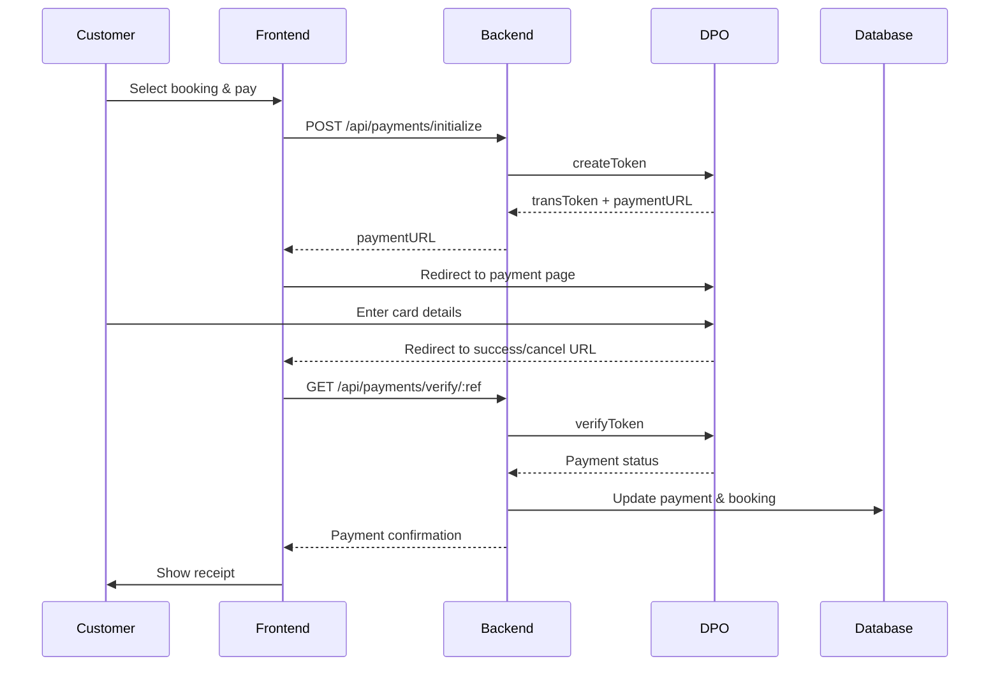
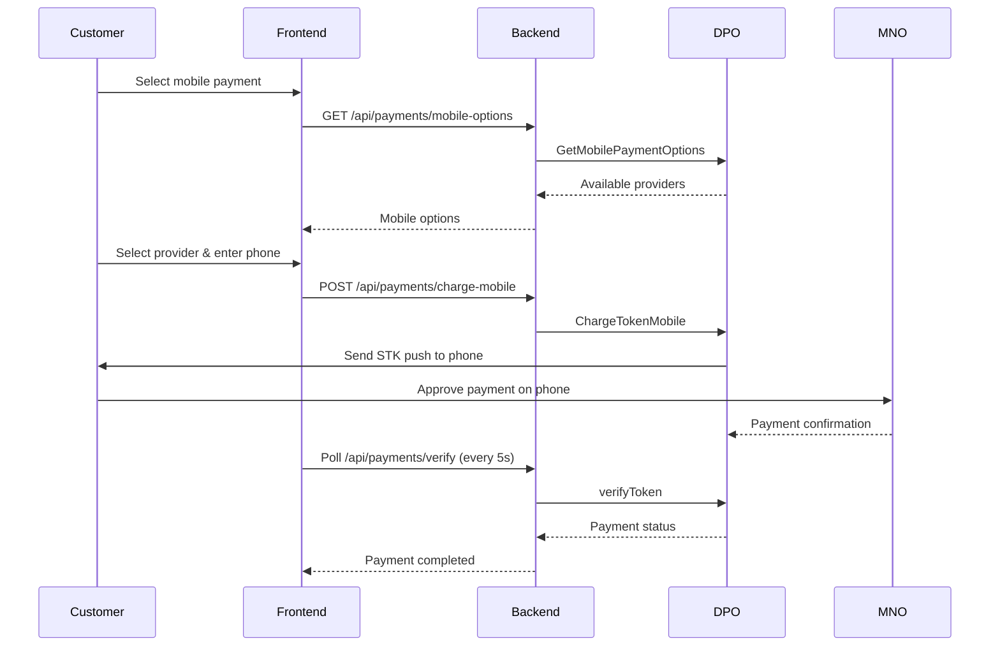

# DPO Pay Integration Guide

## Overview

This document provides comprehensive information about the DPO Pay payment gateway integration for the Voyage Bus Management System. The integration uses DPO Pay API v6 for processing payments in Botswana (BWP), South Africa (ZAR), and other African currencies.

## Table of Contents

1. [Prerequisites](#prerequisites)
2. [Configuration](#configuration)
3. [API Endpoints](#api-endpoints)
4. [Payment Flow](#payment-flow)
5. [Payment Methods](#payment-methods)
6. [Error Handling](#error-handling)
7. [Testing](#testing)
8. [Security Best Practices](#security-best-practices)

## Prerequisites

### DPO Pay Account

1. Sign up for a DPO Pay merchant account at [https://www.dpogroup.com](https://www.dpogroup.com)
2. Complete merchant verification (KYC)
3. Obtain your Company Token (UUID format)
4. Request your Service Type ID from DPO support

### Technical Requirements

- Node.js >= 18.x
- TypeScript >= 5.x
- PostgreSQL >= 14.x (via Supabase)
- Valid SSL certificate (for production)

## Configuration

### Environment Variables

Add the following to your `.env` file:

```bash
# DPO Pay Configuration
DPO_COMPANY_TOKEN=your-company-token-uuid
DPO_SERVICE_TYPE=45
DPO_API_URL=https://secure.3gdirectpay.com/API/v6/
DPO_PAYMENT_URL=https://secure.3gdirectpay.com
DPO_PAYMENT_CURRENCY=BWP
FRONTEND_URL=http://localhost:5173
DPO_PTL=5
```

### Database Setup

Run the payment tables migration:

```bash
# Using Supabase CLI
supabase migration up

# Or apply SQL file directly
psql -h your-db-host -U your-db-user -d your-database -f supabase/migrations/20251126_create_payments.sql
```

## API Endpoints

### 1. Initialize Payment

**POST** `/api/payments/initialize`

Initialize a new payment transaction for a booking.

**Request Body:**
```json
{
  "bookingId": "uuid",
  "amount": 250.00,
  "currency": "BWP",
  "customerEmail": "customer@example.com",
  "customerFirstName": "John",
  "customerLastName": "Doe",
  "customerPhone": "26712345678",
  "customerAddress": "123 Main St",
  "customerCity": "Gaborone",
  "customerCountry": "BW"
}
```

**Response:**
```json
{
  "success": true,
  "paymentId": "uuid",
  "transToken": "dpo-transaction-token",
  "transRef": "DPO123456",
  "paymentURL": "https://secure.3gdirectpay.com/payv2.php?ID=token",
  "companyRef": "ABCD1234"
}
```

### 2. Verify Payment

**GET** `/api/payments/verify/:companyRef`

Verify payment status after customer returns from DPO payment page.

**Response:**
```json
{
  "success": true,
  "status": "completed",
  "result": "000",
  "resultExplanation": "Transaction paid",
  "payment": {
    "id": "uuid",
    "amount": 250.00,
    "customerName": "John Doe",
    "cardLast4": "4321",
    "transactionApproval": "ABC123"
  }
}
```

### 3. Mobile Payment Options

**GET** `/api/payments/mobile-options/:transToken`

Get available mobile money payment options for a transaction.

**Response:**
```json
{
  "success": true,
  "options": [
    {
      "country": "botswana",
      "countryCode": "BW",
      "paymentname": "orange_money",
      "logo": "https://...",
      "cellularprefix": "267",
      "amount": 250.00,
      "currency": "BWP",
      "instructions": "1. Dial *144#..."
    }
  ]
}
```

### 4. Charge via Mobile Money

**POST** `/api/payments/charge-mobile`

Initiate a mobile money payment.

**Request Body:**
```json
{
  "transToken": "dpo-transaction-token",
  "phoneNumber": "26712345678",
  "mno": "orange_money",
  "mnoCountry": "botswana"
}
```

**Response:**
```json
{
  "success": true,
  "statusCode": "130",
  "instructions": "Check your phone for payment prompt...",
  "redirectOption": false
}
```

### 5. Bank Transfer Options

**GET** `/api/payments/bank-options/:transToken`

Get available bank transfer options.

### 6. Charge via Bank Transfer

**POST** `/api/payments/charge-bank-transfer`

Initiate bank transfer payment.

### 7. Refund Payment

**POST** `/api/payments/refund/:companyRef`

Process a full or partial refund.

**Request Body:**
```json
{
  "refundAmount": 100.00,
  "refundReason": "Customer cancellation",
  "userId": "admin-user-id"
}
```

### 8. Cancel Payment

**POST** `/api/payments/cancel/:companyRef`

Cancel an unpaid payment transaction.

### 9. Resend Payment Email

**POST** `/api/payments/resend-email/:companyRef`

Resend payment link to customer email.

### 10. Payment Analytics

**GET** `/api/payments/analytics?startDate=2024-01-01&endDate=2024-12-31&currency=BWP`

Get payment analytics and statistics.

### 11. Health Check

**GET** `/api/payments/health`

Check DPO Pay service configuration status.

## Payment Flow

### Standard Card Payment Flow



### Mobile Money Flow



## Payment Methods

### 1. Credit/Debit Cards

- **Visa**
- **Mastercard**
- **American Express** (if enabled)

**3D Secure:** Supported for enhanced security

### 2. Mobile Money

**Botswana:**
- Orange Money
- Mascom MyZaka

**Kenya:**
- M-Pesa
- Airtel Money

**Tanzania:**
- M-Pesa
- Tigo Pesa
- Airtel Money

**South Africa:**
- MTN Mobile Money

### 3. Bank Transfer

- Direct bank deposits
- EFT payments
- Multi-currency support

## Error Handling

### DPO Result Codes

| Code | Status | Description |
|------|--------|-------------|
| 000 | Success | Transaction paid |
| 001 | Success | Authorized (capture required) |
| 800 | Error | Transaction not authorized |
| 801 | Error | Request missing company token |
| 802 | Error | Company token does not exist |
| 803 | Error | Invalid request type |
| 804 | Error | Error in XML |
| 900 | Pending | Transaction not paid yet |
| 901 | Failed | Transaction declined |
| 902 | Error | Data mismatch |
| 903 | Expired | Payment time limit exceeded |
| 904 | Cancelled | Transaction cancelled |
| 905 | Error | Amount exceeded limit |

### Error Response Format

```json
{
  "error": "Error type",
  "message": "Detailed error message",
  "code": "DPO_ERROR_CODE",
  "details": {}
}
```

## Testing

### Test Cards

DPO provides test cards for sandbox testing:

```
Card Number: 4000 0000 0000 0002
Expiry: Any future date (MM/YY)
CVV: Any 3 digits
```

### Test Environment

```bash
# Use DPO sandbox endpoints
DPO_API_URL=https://secure.sandbox.3gdirectpay.com/API/v6/
DPO_PAYMENT_URL=https://secure.sandbox.3gdirectpay.com
DPO_COMPANY_TOKEN=your-sandbox-token
```

### Running Tests

```bash
# Backend unit tests
cd backend
npm test -- src/services/dpoPayService.test.ts

# Integration tests
npm test -- src/routes/payments.test.ts

# End-to-end payment flow
npm run test:e2e
```

## Security Best Practices

### 1. PCI Compliance

- **Never** store full card numbers in your database
- Store only last 4 digits for display
- Use DPO hosted payment page for card collection
- Enable 3D Secure for all transactions

### 2. Environment Security

```bash
# Use strong secrets
JWT_SECRET=$(openssl rand -hex 64)
SESSION_SECRET=$(openssl rand -hex 32)

# Restrict file permissions
chmod 600 .env
```

### 3. API Security

- Always use HTTPS in production
- Implement rate limiting on payment endpoints
- Validate all input data
- Use CSRF tokens for state-changing operations
- Log all payment transactions (without sensitive data)

### 4. Database Security

- Enable Row Level Security (RLS) on payment tables
- Encrypt sensitive fields at rest
- Regular security audits
- Automated backups with encryption

### 5. Webhook Verification

```typescript
// Verify webhook source
const isValidWebhook = (req: Request): boolean => {
  const signature = req.headers['x-dpo-signature'];
  const computedSig = crypto
    .createHmac('sha256', DPO_WEBHOOK_SECRET)
    .update(JSON.stringify(req.body))
    .digest('hex');
  
  return signature === computedSig;
};
```

## Monitoring & Logging

### Key Metrics to Monitor

1. **Transaction Success Rate** - Target: >95%
2. **Average Payment Time** - Target: <30 seconds
3. **Failed Transaction Rate** - Alert if >5%
4. **Refund Rate** - Alert if >10%
5. **API Response Times** - Target: <2 seconds

### Logging Best Practices

```typescript
// Log payment events (sanitized)
logger.info('Payment initialized', {
  paymentId,
  amount,
  currency,
  customerEmail: mask(customerEmail), // Mask PII
  timestamp: new Date().toISOString(),
});

// Never log sensitive data
// ❌ DON'T: logger.info('Card:', cardNumber, cvv);
// ✅ DO: logger.info('Card last 4:', cardLast4);
```

## Troubleshooting

### Common Issues

#### 1. "Company token does not exist"

**Solution:** Verify `DPO_COMPANY_TOKEN` is correct and active

#### 2. "Payment Time Limit exceeded"

**Solution:** Payment link expired. Generate new token

#### 3. "Transaction not paid yet"

**Solution:** Normal status - wait for customer to complete payment

#### 4. Mobile money timeout

**Solution:** 
- Check phone number format includes country code
- Verify mobile network is operational
- Customer may need to approve on their phone

### Support

- **DPO Technical Support:** support@directpay.online
- **Phone:** +254 709 977 000
- **Documentation:** https://www.dpogroup.com/documentation/

## Appendices

### A. Service Type Codes

| Code | Description |
|------|-------------|
| 45 | Transportation Services |
| 3854 | General Services |
| 5525 | Ticketing |
| 202 | Flights |
| 6264 | Hotels |

### B. Country Codes

| Country | Code | Currency |
|---------|------|----------|
| Botswana | BW | BWP |
| South Africa | ZA | ZAR |
| Kenya | KE | KES |
| Tanzania | TZ | TZS |
| Zimbabwe | ZW | USD |

### C. API Rate Limits

| Endpoint | Limit |
|----------|-------|
| /initialize | 10/minute |
| /verify | 60/minute |
| /refund | 5/minute |
| Other | 100/minute |

## Changelog

### Version 1.0.0 (2024-11-28)
- Initial DPO Pay API v6 integration
- Support for card, mobile money, and bank transfer
- Complete CRUD operations for payments
- Analytics and reporting endpoints
- Comprehensive error handling
- Full TypeScript support

---

**Last Updated:** November 28, 2024  
**Version:** 1.0.0  
**Maintainer:** Voyage Tech Solutions
